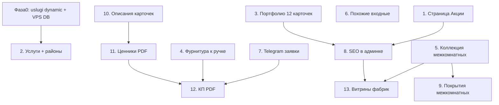

# Roadmap развития сайта «Дверная Точка»

Упорядоченный план работ с учётом зависимостей, текущего состояния кодовой базы и приоритета: сначала контент и стабильность продакшена, затем карточка товара и каталог, затем B2B-инструменты в админке.

---

## Фаза 0 — Быстрые исправления перед контентом

| # | Задача | Зачем | Статус в проекте |
|---|--------|-------|------------------|
| 0.1 | Сделать `/uslugi` динамической (`export const dynamic = "force-dynamic"`) | На VPS правки услуг в CMS не видны без пересборки — страница статически пререндерится при `next build` | **Баг** |
| 0.2 | Проверить, что админка и витрина на VPS смотрят в **одну** БД (`DATABASE_URL`) | Локальные правки не попадают на прод сами по себе | Операционная проверка |

**Критерий готовности:** правка в `/admin/services` на VPS сразу видна на `/uslugi` без rebuild.

---

## Фаза 1 — Контент и публичные страницы

### 1. Страница «Акции»

**Цель:** отдельная публичная страница со всеми акциями, которые листаются на главной.

**Сейчас есть:**

- таблица `promotion_banners`, админка `/admin/promotions`
- слайдер на главной (`HomePromotions`, `promotionService`)

**Нужно сделать:**

- маршрут `/promotions` или `/akcii` (и редирект с дублей)
- список/сетка всех активных баннеров (те же данные, что на главной)
- SEO: title, description, canonical
- ссылка в меню / футере
- опционально: архив неактивных акций (не в MVP)

**Зависимости:** нет  
**Оценка:** 1–2 дня

---

### 2. Услуги: доставка по районам

**Цель:** дополнить CMS услуг разделом с ценами доставки по районам.

**Сейчас есть:**

- `/admin/services` — разделы + строки прайса (`service_sections`, `service_rows`)
- `/uslugi` читает из БД

**Нужно сделать:**

- контент: раздел «Доставка по районам» (район → цена → примечание)
- при необходимости — подразделы (город / область / за город)
- проверить мобильную вёрстку таблиц (`ServiceTable`)
- зафиксировать `force-dynamic` на `/uslugi` (см. фазу 0)

**Зависимости:** 0.1  
**Оценка:** 0.5–1 день (контент + мелкие доработки UI при необходимости)

---

### 3. Портфолио: 12 карточек и макет

**Цель:** наполнить и отполировать блок «Наши работы».

**Сейчас есть:**

- админка `/admin/portfolio` (проекты, фото, сортировка)
- публичная `/portfolio` (client fetch `/api/portfolio`)

**Нужно сделать:**

- загрузить 12 проектов (фото, заголовки, описания)
- проверить сетку на desktop / tablet / mobile
- lightbox, обрезка фото, пустые состояния
- SEO страницы портфолио

**Зависимости:** нет  
**Оценка:** 1–2 дня (больше контент, чем код)

---

## Фаза 2 — Операционка и SEO

### 7. Интеграция заявок с Telegram

**Цель:** дублировать заявки (замер, корзина, админ-заказы) в Telegram-чат менеджеров.

**Сейчас есть:**

- `POST /api/leads/measure`, `POST /api/leads/cart`
- отправка email через `measureLeadService` + nodemailer
- заявки в БД (`leads`) из админки

**Нужно сделать:**

- env: `TELEGRAM_BOT_TOKEN`, `TELEGRAM_CHAT_ID`
- сервис `telegramNotifyService`: форматированное сообщение (имя, телефон, состав, ссылка на заявку)
- вызов после успешной валидации (параллельно с email, не блокируя ответ)
- обработка ошибок Telegram без падения API

**Зависимости:** нет  
**Оценка:** 1–2 дня

---

### 8. SEO-настройки в админке

**Цель:** редактировать SEO без правок кода.

**Сейчас есть:**

- `seo_title` / `seo_description` у `catalog_pages` — **уже в админке** витрин
- колонки SEO у `products` в БД + чтение в `product-metadata.ts`
- статические тексты в `seo-copy.ts` для страниц

**Нужно сделать:**

- **Товары:** поля SEO в `/admin/products` (форма или модалка)
- **Статические страницы:** таблица `content_pages` (slug, title, description, h1) + экран в админке
- **Главная / акции / услуги / портфолио:** через `content_pages` или поля в существующих сущностях
- превью длины title / description
- sitemap учитывает canonical

**Зависимости:** п.1 (страница акций) упрощает SEO для акций  
**Оценка:** 3–5 дней

---

## Фаза 3 — Карточка товара и каталог

### 4. Сопутствующая фурнитура к ручке (фиксированный порядок)

**Цель:** у карточки ручки показывать комплект в строгой последовательности:

1. фиксатор
2. магнитный замок
3. обычный замок
4. врезная петля
5. петля-бабочка
6. скрытая петля

**Сейчас есть:**

- `loadRelatedFittingsForHandle` в `fittingsRelated.js` — 3 группы: фиксаторы (1), защёлки (2), петли (3), случайная выборка
- UI: `ProductRelatedFittings`

**Нужно сделать:**

- разбить подкатегории / атрибуты: магнитный vs обычный замок, типы петель
- жёсткий порядок групп и карточек в UI (не `ORDER BY RANDOM()`)
- правила подбора по производителю + артикул цвета (+ розетка для фиксатора)
- fallback, если позиции нет в наличии
- тесты на подбор

**Зависимости:** корректная номенклатура фурнитуры в каталоге  
**Оценка:** 3–4 дня

---

### 5. Межкомнатные: двери из той же коллекции

**Цель:** на карточке межкомнатной двери — блок «Другие двери коллекции».

**Сейчас есть:**

- `model_key` + `colorVariants` / `glassVariants` для переключателей
- атрибуты коллекции / производителя в `attrs`

**Нужно сделать:**

- правило группировки: та же коллекция (атрибут или `model_key` + категория)
- API: `relatedCollectionProducts` в `getProductById`
- UI-блок: 4–8 карточек, исключая текущую
- сортировка: популярность / цена

**Зависимости:** единообразные атрибуты коллекции в CSV / админке  
**Оценка:** 2–3 дня

---

### 6. Входные: похожие двери (±30%, та же категория)

**Цель:** блок «Похожие входные двери».

**Нужно сделать:**

- SQL / API: та же корневая категория, `price BETWEEN 0.7x AND 1.3x`, `is_active`, с фото
- исключить текущий товар и colorVariants
- лимит 6–8, сортировка по близости цены
- UI аналогично блоку коллекции

**Зависимости:** нет  
**Оценка:** 1–2 дня

---

### 10. Причесать карточки товаров с описаниями

**Цель:** единый вид описаний, характеристик, пустых полей.

**Нужно сделать:**

- шаблон описания по типу товара (входная / межкомнатная / фурнитура)
- скрывать пустые атрибуты (`is_visible_on_product`)
- единые подписи, единицы измерения
- массовое заполнение через CSV или админку
- контент-ревью топ-50 SKU

**Зависимости:** п.5, п.6  
**Оценка:** 2–3 дня код + отдельно контент

---

### 9. Выбор покрытия (межкомнатные, отдельный тип)

**Цель:** для определённых моделей — выпадающий выбор покрытия с пиктограммами и наценкой.

**Сейчас:** нет — потребуется новая модель данных.

**Нужно сделать:**

- сущность `product_coating_options` или атрибут-ось с ценовыми модификаторами
- админка: привязка покрытий к модели / коллекции, иконка, доплата
- UI: селектор с иконками, пересчёт цены, передача в корзину / заявку
- правило: только для отмеченных товаров / коллекций

**Зависимости:** п.5, стабильные атрибуты коллекции  
**Оценка:** 5–7 дней

---

## Фаза 4 — B2B-инструменты в админке

### 11. Формирование ценников (входные / межкомнатные)

**Цель:** печать ценников из админки.

**Сейчас:** нет; есть экспорт CSV и договор `.docx` для заявок.

**Нужно сделать:**

- шаблоны ценника: входная / межкомнатная (цена, цена комплекта, ключевые характеристики)
- выбор товаров: из таблицы, по фильтру, по категории
- генерация PDF или HTML для печати (A5 / A6)
- QR на карточку товара (опционально)

**Зависимости:** п.10 (стабильные атрибуты)  
**Оценка:** 4–6 дней

---

### 12. КП в PDF для заказов

**Цель:** коммерческое предложение по заявке: входная дверь, межкомнатная + фурнитура.

**Сейчас есть:**

- заявки `/admin/leads/[id]`, позиции, скидки
- договор `.docx` (`contractDocumentService`)

**Нужно сделать:**

- шаблоны КП: входная / межкомнатная + комплект
- PDF (`pdfkit`, `@react-pdf/renderer` или Puppeteer)
- кнопка «Скачать КП» в карточке заявки
- логотип, реквизиты, состав, итог, срок действия предложения

**Зависимости:** п.11, п.4  
**Оценка:** 5–8 дней

---

## Фаза 5 — Витрины фабрик / коллекций

### 13. Витрины под фабрики с карточками коллекций

**Цель:** отдельная витрина на фабрику → сначала коллекции → внутри коллекции двери.

**Сейчас есть:**

- `catalog_pages` — плоская витрина с фильтрами
- нет уровня «коллекция как landing»

**Нужно сделать:**

- модель: `factory` → `collection` → `products`
- новый тип витрины или вложенные `catalog_pages` (parent / child)
- landing коллекции: обложка, описание, список моделей
- маршруты: `/catalog/factory/bravo` → `/catalog/factory/bravo/classic`
- админка: управление коллекциями, привязка товаров
- SEO на уровне фабрики и коллекции

**Зависимости:** атрибуты manufacturer / collection, п.8 (SEO), п.5  
**Оценка:** 10–15 дней

---

## Сводная очередность

| Очередь | Пункт | Фаза | Приоритет |
|--------|-------|------|-----------|
| 1 | 0.1–0.2 Исправление `/uslugi` на проде | 0 | P0 |
| 2 | 2. Услуги + доставка по районам | 1 | P0 |
| 3 | 3. Портфолио (12 карточек) | 1 | P0 |
| 4 | 1. Страница «Акции» | 1 | P1 |
| 5 | 7. Telegram для заявок | 2 | P1 |
| 6 | 8. SEO в админке | 2 | P1 |
| 7 | 4. Фурнитура к ручке (порядок) | 3 | P1 |
| 8 | 6. Похожие входные ±30% | 3 | P2 |
| 9 | 5. Коллекция межкомнатных | 3 | P2 |
| 10 | 10. Описания карточек | 3 | P2 |
| 11 | 9. Выбор покрытия | 3 | P2 |
| 12 | 11. Ценники | 4 | P3 |
| 13 | 12. КП PDF | 4 | P3 |
| 14 | 13. Витрины фабрик | 5 | P3 |

---

## Ориентир по срокам (1 разработчик)

| Фаза | Содержание | Дни |
|------|------------|-----|
| 0 | Прод-фикс услуг | 0.5 |
| 1 | Акции, услуги, портфолио | 3–5 |
| 2 | Telegram, SEO | 4–7 |
| 3 | Карточка товара (4–6, 9–10) | 14–20 |
| 4 | Ценники, КП | 9–14 |
| 5 | Витрины фабрик | 10–15 |
| **Итого** | | **~40–60 рабочих дней** |

Контент (фото, тексты, 12 проектов портфолио, заполнение районов доставки) лучше вести параллельно с фазами 1–3.

---

## Уже частично готово (не делать с нуля)

| Задача | Уже в проекте |
|--------|----------------|
| Акции на главной | `promotion_banners`, `/admin/promotions` |
| Услуги в CMS | `/admin/services`, БД, `/uslugi` |
| Портфолио CMS | `/admin/portfolio`, `/portfolio` |
| Фурнитура к ручке | `fittingsRelated.js` — нужен порядок и типы |
| Заявки | API + email + админка `leads` |
| SEO витрин | поля в `/admin/catalog-pages` |
| SEO товаров | колонки в БД, нет UI в админке товаров |
| Договор по заявке | `.docx`, не PDF КП |
| Экспорт каталога CSV | `/api/admin/products/export` |

---

## Связанные документы

- [CSV-импорт / экспорт](./csv-import.md)
- [Деплой на VPS](./vps-nginx-admin-deploy.md)
- [Google Search Console](./google-search-console.md)
- [Схема БД](./database.md)
